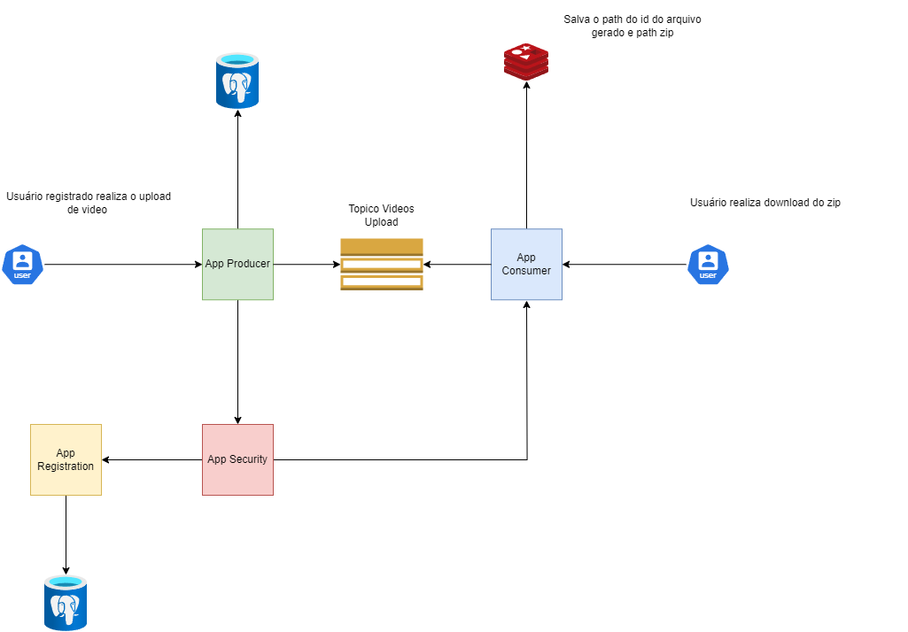

# Projeto Hackaton Infra

Este README traz o **fluxo mínimo** para rodar localmente o cluster kubernetes com as aplicações e serviços relacionados a entrega techchallenge hackaton fase 5

---

## Pré‑requisitos Geraus

- Java 17 e Maven
- Docker (Desktop)
- Minikube e kubectl

---

## Passos

Pré-requisitos para execução do projeto

1️⃣ Instalação do Minikube

Baixe o Minikube em: https://minikube.sigs.k8s.io/docs/start/

Para sistemas Unix-like com Docker:

curl -LO https://storage.googleapis.com/minikube/releases/latest/minikube-linux-amd64
sudo install minikube-linux-amd64 /usr/local/bin/minikube

Em seguida, verifique:
```bash
minikube version
```

2️⃣ Inicialização e configuração do Minikube

Antes de iniciar o cluster, defina os recursos desejados:
```bash
minikube config set memory 8192
minikube config set cpus 4
```

Agora inicie o Minikube:
```bash
minikube start --driver=docker
minikube addons enable metrics-server
```

3️⃣ Build das Imagens Locais

É necessário gerar o JAR antes de criar a imagem. Para cada projeto (producer, consumer, gateway, security, registration), siga estes passos dentro da pasta correspondente:

# Producer
cd ../producer
mvn clean package -DskipTests
ls target/producer-0.0.1-SNAPSHOT.jar
docker build -t hackaton-producer:latest .

# Consumer
cd ../consumer
mvn clean package -DskipTests
ls target/consumer-0.0.1-SNAPSHOT.jar
docker build -t hackaton-consumer:latest .

# Gateway
cd ../gateway
mvn clean package -DskipTests
ls target/gateway-0.0.1-SNAPSHOT.jar
docker build -t hackaton-gateway:latest .

# Security
cd ../security
mvn clean package -DskipTests
ls target/security-0.0.1-SNAPSHOT.jar
docker build -t hackaton-security:latest .

# Registration
cd ../registration
mvn clean package -DskipTests
ls target/registration-0.0.1-SNAPSHOT.jar
docker build -t hackaton-registration:latest .

# Voltar para a pasta de scripts para o deploy
cd ../scripts

4️⃣ Deploy da aplicação

Certifique-se de conceder permissão de execução do script e na sequência aplique todos os manifests :

```bash
chmod +x deploy.sh
./deploy.sh
```
5️⃣ Validação dos Pods

Após o deploy, valide que todos os pods estão no status Running:

kubectl get pods -o wide

Verifique também serviços, HPA e endpoints com:

kubectl get svc,hpa

Você deve ver as aplicações producer, consumer, gateway, redis, kafka, zookeeper, postgres, security e registration com seus respectivos serviços e pods disponíveis.

6️⃣ Port-forward

O script já realiza um port-forward do serviço gateway:

kubectl port-forward svc/gateway-service 30090:8080

Depois disso, acesse a aplicação via curl ou chamada localhost na porta configurada mais a rota declarada no gateway como no exemplo abaixo :

curl -v http://localhost:30090/producer/videos


## 📊 Arquitetura do Projeto


